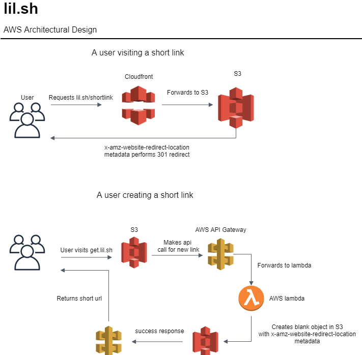

# lil.sh
Open source AWS s3 link shortener. 

The free version has been shut down due to misuse.

## Design

lil.sh utilizes the ability to have a static website using the amazon [s3](https://aws.amazon.com/s3/) service and
the ability to perform a 301 redirect using the metadata [x-amz-website-redirect-location](https://docs.aws.amazon.com/AmazonS3/latest/dev/how-to-page-redirect.html)
to perform redirects. The idea is that you put a black object with that metadata into a static s3 website and
you have a link shortener!

lil.sh then uses the AWS Api gateway for a way for users can create their own short urls by wrapping this method
onto an API. We then create a frontend which in this case is separated onto the domain https://get.lil.sh.



## Installation

There are 3 primary parts to get lil.sh to work. The backend (the link shortener), the frontend get.lil.sh and the API api.lil.sh.

The backend exists under templates/backend.yml you can deploy this using AWS cloudformation either via CLI or the console. This also deploys
the frontend static website aswell.

the api is deployed using [serverless framework](https://www.serverless.com/) which you can deploy using the command

```shell script
sls deploy -s prod
```

the api also using a cloudformation template for teh custom domain. Which lives under templates/api-domain.yml.


## Testing

You can run tests for the api by first installing dependencies

```shell script
pip install -r api/requirements-dev.txt
```

and then running the tests using pytest

```shell script
python -m pytest api/tests
```


## Notes

The API can be used publicly but isn't really supported feel free to use it if you figure it out
but use it appropriately.

Github actions is used for CICD. You can replicate it quite easily by forking the repo.

There is no real dev environment for this as its hard to create without excess work. So be careful when raising PR's.

I am not a frontend designer I know its pretty shoddy code.

## Acknowledgments

- Big Shout out to https://github.com/ofnullable/react-spa-template for the template for the frontend
- [Moto](https://github.com/spulec/moto) is used for mocking S3 testing

## License


[GNU](https://choosealicense.com/licenses/gpl-3.0/)
